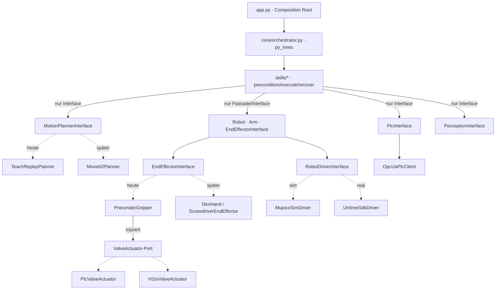

# Architektur — h2_loader

## Schichtenmodell

```
app  (Composition Root: wählt & verdrahtet konkrete Treiber)
 └─ core      Ablaufsteuerung (py_trees-Orchestrator, Skill-Knoten, Safety)
     └─ skills    Anwendungslogik (load/unload/change_inductor)
         └─ { motion, hal, perception, plc }   — angesprochen NUR über Interfaces
```

**Grundregel:** Höhere Schichten kennen ausschließlich die abstrakten Interfaces der tieferen
Schichten, nie deren konkrete Treiber. Einzige Ausnahme ist `app.py` (Composition Root) — dort, und
nur dort, werden konkrete Implementierungen ausgewählt und zusammengesteckt.

## Komponenten & Datenfluss



## Die drei Austauschpunkte

| Austauschpunkt | Interface | heute | später |
|----------------|-----------|-------|--------|
| Bewegung | `motion.base.MotionPlannerInterface` | `TeachReplayPlanner` | `MoveIt2Planner` (ROS2) |
| Endeffektor | `hal.end_effector.base.EndEffectorInterface` | `PneumaticGripper` | `DexHand`, `ScrewdriverEndEffector` |
| Ventil-Anbindung | `hal.end_effector.valve_actuator.ValveActuator` | offen (`H2IoValveActuator` default) | `PlcValveActuator` |
| Roboter-Lowlevel | `hal.drivers.base.RobotDriverInterface` | `MujocoSimDriver` | `UnitreeSdkDriver` |

Ein Wechsel betrifft jeweils **nur `app.py`** (welche Klasse instanziiert wird) — kein Skill, kein
Orchestrator ändert sich.

## Ablauf der Lade-Sequenz (Behavior Tree)

Jeder Skill implementiert `precondition() → execute() → recover()`; `core/behavior/skill_behavior.py`
adaptiert das auf einen py_trees-Behaviour, `core/orchestrator.py` verdrahtet die Skills zu einer
Sequence. Beispiel `LoadWorkpieceSkill`:

```
precondition:  DOOR_OPEN ∧ FIXTURE_FREE
execute:       wait_for(DOOR_OPEN) → move_to(PICK) → grasp()
               → move_to(PLACE) → release() → write(ROBOT_DONE)
recover:       release()  (Greifer öffnen, sicherer Zustand)
```

Ist py_trees nicht installiert, greift im Orchestrator ein semantisch identischer Fallback-Runner —
so bleiben Import, Dry-Run und Tests auch ohne die Zusatz-Dependency lauffähig.

## Sicherheit

`core/safety.py` (`SafetyGate`) ist eine **software-seitige** Freigabe vor Bewegungsaktionen und
**kein Ersatz** für den zertifizierten, zweikanaligen SPS-Sicherheitskreis. Die eigentliche
Sicherheit liegt in der Maschinensteuerung.

## Konfiguration statt Code

Posen (`config/poses/*.yaml`), Maschinengeometrie (`config/machine.yaml`), SPS-Endpunkt/Signale
(`config/plc.yaml`) und Treiberwahl (`config/robot.yaml`) liegen als YAML vor und werden über
`util/config.py` in typisierte Objekte geladen.
